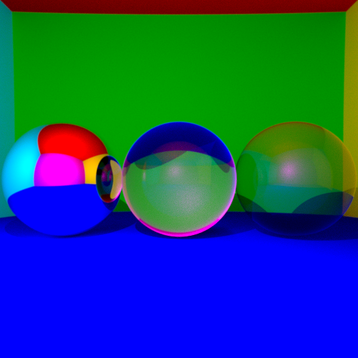

This repository contains my implementation of the first project for CSE306: Computer Graphics.

- `main.cpp` contains the code that implements the required features. It can be compiled with `g++ main.cpp  -fopenmp -lpthread -std=c++17 -o main.out`
- 'report.pdf' containsa report summarizing my work and highlighting the implemented features through a series of renders of spheres and triangle meshes, along with informations regarding parameters and timings
- The repository also contains a required dependency and the object file for the cat's mesh. "spheres.png" contains a render replicating that from lecture 1, slide 42, generated for 1000 rays per pixel.  

  

